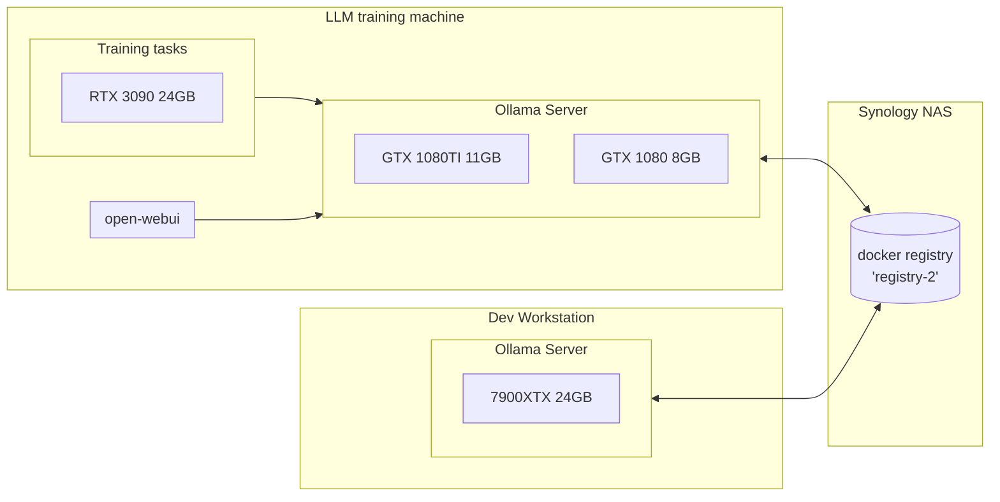

# llm-docs

This document describes my first journey to LLM finetuning. Do not threat this as a guide but rather more like a diary / summary. For the sake of clearance this will be as much technical as possible. I must  make a clear statement from the beginning: This doc **doesn't cover ROCm** finetunning. 

## Table of Contents:

[Lab details](#lab)
- [LLM training machine](#llm-training-machine)
- [Dev Workstation](#dev-workstation)
- [Synology NAS](#synology-nas)

[Software / framework used](#software)
- [ROCm](#rocm)
- [CUDA](#cuda)
- [Ollama](#ollama)
- [llama.cpp](#llamacpp)
- [Python modules](#python)
- [Monitoring](#monitoring)

[Models](#models)
- [Hugging Face](#hugging-face)
- [Ollama custom models](#ollama-custom-models)
- [Note on PARAMETER num_gpu](#note-on-parameter-num_gpu)

[Training](#training)
- [Preliminary assumptions](#preliminary-assumptions)
- [Finetunning script](#finetunning-script)
- [Dataset](#dataset)
- [Usage](#usage)
- [Validation](#validation)
- [Quantization and GGUF conversion](#quantization-and-gguf-conversion)
- [Test in Ollama](#test-in-ollama)

[Final words](#final-words)

## Lab 
General information regarding hardware and software used in my lab. 


### LLM training machine

I have done my best to work with AMD cards but at this point I had to give up. If you need to to run a model with *llama.cpp* (ROCm) backend it works quite great. During training attempts I faced a lot of issues with different forks of `bitsandbytes` and `torch`. Maybe in the future I'll switch back to AMD, as for now I'll stick to NVIDIA cards. 

Setup: 
- i5 7400 
- 32 GB RAM 2400 CL16
- 2 * 256 GB SSD
- RTX3090, GTX1080TI, GTX1080
- B250 ASUS MINING EXPERT (18 * PCIe x1, 1 * PCIe x16)
- Ubuntu 22.04
- CUDA 12.4

As soon as I learn how to train using parallel pipelines on multi gpu rigs I'll pimp this beauty with more cards. GTX cards are because they support CUDA 12x and I may use them for quick test of fine tuned models or just serve as helper LLM backend (code assistant etc.)

### Dev Workstation

Maybe some day I'll transform this into a training server but for now I use it as a playground / sandpit. This is the place where I have tried to make ROCm to work with `bitsandbytes`... but I failed... for now. This machine is over buffed as for its purpose but this is the best place where I can try really large (70B) models with *llama.cpp/ollama*. 

Setup:
- i9 10940x
- 64 GB RAM 3200 CL18
- 3TB NVMe 
- RX 7900 XTX
- MSI X299 Tomahawk
- Ubuntu 22.04
- ROCm 6.0.2

### Synology NAS

Just a typical NAS. Model DS423 with several TB of disks, RAID1 , hot spare. The main purpose in this scope is to serve as Docker Registry. Why? Because [Ollama](#ollama) uses docker layers for models. It's possible to store models as standard Docker images. Models consume a lot of storage. It's easier to maintain, control version and backup models using docker registry. It may also open a path for CI/CD pipelines. For dev environments registry may be deployed as standard Linux Docker service:

```
$ docker run -d -p 5000:5000 --restart always --name registry registry:2
```
If you want to mount some dedicated storage for models add `-v /path/to/storage:/var/lib/registry` to the command line. 

I also suggest to deploy some UI for the registry. Back in the days I have played with Portainer but since most of useful features are paid I gave a try to [joxit/docker-registry-ui](https://github.com/Joxit/docker-registry-ui). If you go with that, remember to setup environment variable `-e DELETE_IMAGES=true` in order to enable "delete" icon. Moreover you need to add `-e REGISTRY_STORAGE_DELETE=TRUE` to *registry* container startup.
Keep in mind that deleting images with UI doesn't remove blobs from storage. Please refer to [joxit/docker-registry-ui](https://github.com/Joxit/docker-registry-ui) documentation for more details.

## Software 

I assume that common development requirements are already met: kernel headers, gcc, make, cmake , libstdc++ etc. I can't provide detailed list at this point. Maybe I'll work on something in the next revision.

### ROCm 
I use it only for testing models with Ollama(llama). Not a single training tasks worked for me so far. Maybe some day... Anyway this is how I installed [6.0.2](https://rocm.docs.amd.com/projects/install-on-linux/en/docs-6.0.2/how-to/native-install/ubuntu.html) on my Dev Workstation, with native package manager (apt):

1. Add key
```
# Make the directory if it doesn't exist yet.
# This location is recommended by the distribution maintainers.
sudo mkdir --parents --mode=0755 /etc/apt/keyrings

# Download the key, convert the signing-key to a full
# keyring required by apt and store in the keyring directory
wget https://repo.radeon.com/rocm/rocm.gpg.key -O - | \
    gpg --dearmor | sudo tee /etc/apt/keyrings/rocm.gpg > /dev/null
```
2. Register kernel-mode driver
```
echo "deb [arch=amd64 signed-by=/etc/apt/keyrings/rocm.gpg] https://repo.radeon.com/amdgpu/6.0.2/ubuntu jammy main" \
    | sudo tee /etc/apt/sources.list.d/amdgpu.list
sudo apt update
```
3. Register ROCm packages
```
echo "deb [arch=amd64 signed-by=/etc/apt/keyrings/rocm.gpg] https://repo.radeon.com/rocm/apt/6.0.2 jammy main" \
    | sudo tee --append /etc/apt/sources.list.d/rocm.list
echo -e 'Package: *\nPin: release o=repo.radeon.com\nPin-Priority: 600' \
    | sudo tee /etc/apt/preferences.d/rocm-pin-600
```

4. Install kernel driver
```
sudo apt install amdgpu-dkms
sudo reboot
```

5. Install ROCm packages
```
sudo apt install rocm
```
Now you should be able to compile ROCm applications:
```
$ hipcc --version
HIP version: 6.0.32831-204d35d16
AMD clang version 17.0.0 (https://github.com/RadeonOpenCompute/llvm-project roc-6.0.2 24012 af27734ed982b52a9f1be0f035ac91726fc697e4)
Target: x86_64-unknown-linux-gnu
Thread model: posix
InstalledDir: /opt/rocm-6.0.2/llvm/bin
Configuration file: /opt/rocm-6.0.2/lib/llvm/bin/clang++.cfg
```

### CUDA 

For CUDA the procedure is quite similar. Avoid using distro packages, go with NVIDIA's one. Here is how it's done for [12.4](https://developer.nvidia.com/cuda-downloads?target_os=Linux&target_arch=x86_64&Distribution=Ubuntu&target_version=22.04&target_type=deb_network) on my LLM training machine.

1. Install repository and keyrings.
```
wget https://developer.download.nvidia.com/compute/cuda/repos/ubuntu2204/x86_64/cuda-keyring_1.1-1_all.deb
sudo dpkg -i cuda-keyring_1.1-1_all.deb
```
2. Update packages list
```
sudo apt-get update
```

3. Install CUDA toolkit
```
sudo apt-get -y install cuda-toolkit-12-4
```

4. In case you need driver
```
sudo apt-get install -y cuda-drivers
```
And add this to your .bashrc

```
export PATH=/usr/local/cuda/bin${PATH:+:${PATH}}
export LD_LIBRARY_PATH=/usr/local/cuda-12.2/lib64${LD_LIBRARY_PATH:+:${LD_LIBRARY_PATH}}
```
And relogin. From now on you should be able to compile CUDA applications.
```
$ nvcc --version
nvcc: NVIDIA (R) Cuda compiler driver
Copyright (c) 2005-2024 NVIDIA Corporation
Built on Tue_Feb_27_16:19:38_PST_2024
Cuda compilation tools, release 12.4, V12.4.99
Build cuda_12.4.r12.4/compiler.33961263_0
```

### Ollama

*[Ollama](https://github.com/ollama/ollama) is a streamlined tool for running open-source LLMs locally.*  It works in client-server mode. It provides own models library but also allows running external models. More on that topic in [models](#models) section
Build process is the same for both CUDA and RoCM environment. It uses `go` to detect capabilities and build binaries. I strongly suggest to build Ollama from the source. I like hardcore so I always go with master branch. 

1. Clone repo
```
git clone https://github.com/ollama/ollama.git
cd ollama
```

2. Build feature libraries and Ollama binary
```
go generate ./...
go build .
```

3. Test if it works:
- start server
```
./ollama serve
```
- connect as client with some test model
```
./ollama run orca-mini
```
In server console you should see something like this:
```
time=2024-03-29T18:44:43.757+01:00 level=INFO source=routes.go:1118 msg="Listening on 127.0.0.1:11434 (version 0.0.0)"
time=2024-03-29T18:44:43.757+01:00 level=INFO source=payload_common.go:112 msg="Extracting dynamic libraries to /tmp/ollama2312906070/runners ..."
time=2024-03-29T18:44:43.960+01:00 level=INFO source=payload_common.go:139 msg="Dynamic LLM libraries [cpu_avx2 cpu rocm_v60002 cpu_avx]"
time=2024-03-29T18:44:43.960+01:00 level=INFO source=gpu.go:77 msg="Detecting GPU type"
time=2024-03-29T18:44:43.960+01:00 level=INFO source=gpu.go:191 msg="Searching for GPU management library libnvidia-ml.so"
time=2024-03-29T18:44:43.962+01:00 level=INFO source=gpu.go:237 msg="Discovered GPU libraries: []"
time=2024-03-29T18:44:43.963+01:00 level=INFO source=cpu_common.go:11 msg="CPU has AVX2"
time=2024-03-29T18:44:43.963+01:00 level=INFO source=amd_linux.go:50 msg="AMD Driver: 6.3.6"
time=2024-03-29T18:44:43.963+01:00 level=INFO source=amd_linux.go:88 msg="detected amdgpu versions [gfx1100]"
time=2024-03-29T18:44:43.966+01:00 level=INFO source=amd_linux.go:119 msg="amdgpu [0] gfx1100 is supported"
time=2024-03-29T18:44:43.966+01:00 level=INFO source=amd_linux.go:246 msg="[0] amdgpu totalMemory 24560M"
time=2024-03-29T18:44:43.966+01:00 level=INFO source=amd_linux.go:247 msg="[0] amdgpu freeMemory  24560M"
[...]
llm_load_tensors: ggml ctx size =    0.18 MiB
llm_load_tensors: offloading 26 repeating layers to GPU
llm_load_tensors: offloading non-repeating layers to GPU
llm_load_tensors: offloaded 27/27 layers to GPU
llm_load_tensors:      ROCm0 buffer size =  1832.60 MiB
llm_load_tensors:        CPU buffer size =    54.93 MiB
..............................................................................................
llama_new_context_with_model: n_ctx      = 2048
llama_new_context_with_model: freq_base  = 10000.0
llama_new_context_with_model: freq_scale = 1
llama_kv_cache_init:      ROCm0 KV buffer size =   650.00 MiB
llama_new_context_with_model: KV self size  =  650.00 MiB, K (f16):  325.00 MiB, V (f16):  325.00 MiB
llama_new_context_with_model:  ROCm_Host input buffer size   =    11.27 MiB
llama_new_context_with_model:      ROCm0 compute buffer size =   157.00 MiB
llama_new_context_with_model:  ROCm_Host compute buffer size =     6.25 MiB
llama_new_context_with_model: graph splits (measure): 2
{"function":"initialize","level":"INFO","line":416,"msg":"initializing slots","n_slots":1,"tid":"130501826303552","timestamp":1711734452}
{"function":"initialize","level":"INFO","line":428,"msg":"new slot","n_ctx_slot":2048,"slot_id":0,"tid":"130501826303552","timestamp":1711734452}
time=2024-03-29T18:47:32.091+01:00 level=INFO source=dyn_ext_server.go:159 msg="Starting llama main loop"
{"function":"update_slots","level":"INFO","line":1544,"msg":"all slots are idle and system prompt is empty, clear the KV cache","tid":"130491281827392","timestamp":1711734452}
[GIN] 2024/03/29 - 18:47:32 | 200 |  3.044210008s |       127.0.0.1 | POST     "/api/chat"
[...]
```

Here is the content worth highlighting:
- `Dynamic LLM libraries [cpu_avx2 cpu rocm_v60002 cpu_avx]` - features that are supported by Ollama. Detected during `go generate` step, followed by details of the capabilities to be used: `CPU has AVX2` , `amdgpu [0] gfx1100 is supported`
- `offloaded 27/27 layers to GPU` - number of model layers that were fit into VRAM. If a model is too big for gfx card , layers that didn't fit will be offloaded to RAM. In that case expect degraded efficiency. Amount of used GPU layers may be controlled by [Modelfile](#ollama-custom-models) PARAMETER num_gpu. 

In client console you should see something like this: 

```
pulling manifest 
pulling 66002b78c70a... 100% ████████████████████▏ 2.0 GB                         
pulling dd90d0f2b7ee... 100% ████████████████████▏   95 B                         
pulling 93ca9b3d83dc... 100% ████████████████████▏   89 B                         
pulling 33eb43a1488d... 100% ████████████████████▏   52 B                         
pulling fd52b10ee3ee... 100% ████████████████████▏  455 B                         
verifying sha256 digest 
writing manifest 
removing any unused layers 
success 
>>> Hi.
 Hello! How may I assist you today?
```

If you want to connect to Ollama server remotely instead of via loopback interface, you need to set up environment variable before starting the server:
```
export OLLAMA_HOST=0.0.0.0:11434
```
This will open 11434 port for remote connections. From now on you can use tools like [open-webui](https://github.com/open-webui/open-webui) hosted remotely, or just make API calls from remote locations
```
$ curl http://ollama.server.ip:11434/api/generate -d '{
  "model": "orca-mini",
  "prompt":"Hi!"
}'
{"model":"orca-mini","created_at":"2024-03-29T18:14:27.8102869Z","response":" Hello","done":false}
{"model":"orca-mini","created_at":"2024-03-29T18:14:27.817425083Z","response":"!","done":false}
{"model":"orca-mini","created_at":"2024-03-29T18:14:27.825094392Z","response":" How","done":false}
{"model":"orca-mini","created_at":"2024-03-29T18:14:27.831823729Z","response":" can","done":false}
{"model":"orca-mini","created_at":"2024-03-29T18:14:27.838518321Z","response":" I","done":false}
{"model":"orca-mini","created_at":"2024-03-29T18:14:27.845172016Z","response":" assist","done":false}
{"model":"orca-mini","created_at":"2024-03-29T18:14:27.852140123Z","response":" you","done":false}
{"model":"orca-mini","created_at":"2024-03-29T18:14:27.858785479Z","response":" today","done":false}
{"model":"orca-mini","created_at":"2024-03-29T18:14:27.865394695Z","response":"?","done":false}
{"model":"orca-mini","created_at":"2024-03-29T18:14:27.872187158Z","response":"","done":true,"context":[31822,13,8458,31922,3244,31871,13,3838,397,363,7421,8825,342,5243,10389,5164,828,31843,9530,362,988,362,365,473,31843,13,13,8458,31922,9779,31871,13,31866,31827,31905,13,13,8458,31922,13166,31871,13,16644,31905,1035,473,312,2803,365,1703,31902],"total_duration":86571512,"load_duration":287921,"prompt_eval_count":10,"prompt_eval_duration":24012000,"eval_count":10,"eval_duration":61797000}
```

### llama.cpp
*Inference of Meta's LLaMA model (and others) in pure C/C++.* This framework is already used in a form of library by Ollama. I use binaries and some scripts for model testing, postprocessing , conversion and quantization.

How to compile using `make`:

1. Clone repository
```
git clone https://github.com/ggerganov/llama.cpp.git
cd llama.cpp
```
2. Build for ROCm:
```
make LLAMA_HIPBLAS=1
```

3. Or build for CUDA:
```
make LLAMA_CUDA=1
```
That's it. Besides several Python scripts, you should find binaries like `main`, `finetune`,`quantize` etc. Note: you may add `-j<num_of_threads>` to `make` command to speed up compilation process. 

### Python (CUDA only)

Here comes the most clumsy part, dominated by CUDA framework, very fragile with a tendency to change frequently. This part is required for finetuning process. Maybe some day I'll manage to make ROCm to work. Ok, here is a step-by-step what instruction for Python:

1. Create and activate virtual environment. This is a must! 

```
python3 -m venv venv
source venv/bin/activate
```

2. Install required Python modules

```
pip3 install git+https://github.com/huggingface/transformers@v4.31-release
pip3 install huggingface_hub matlplotlib bitsandbytes peft trl datasets sentencepiece tensorboard
pip3 install torch torchvision torchaudio
```
`torch` will be installed because of `bitsandbytes` but maybe you'll need `torchvision` and `torchaudio` for other purposes. 

Note on transformers version: I stick to version 4.31 due to some issues with merging models. I'm not sure how to deal with error in latest (4.39) version so I decided to rollback to 4.31. For the purpose of this document it's not an issue, yet this is something I will definitely take a closer look at in the future.

### Monitoring

I'm using two console tools: `btop` and `nvtop`. Both are part of Ubuntu 22.04. Unfortunately `nvtop` from Ubuntu is not working with ROCm so I had to compile it from the [source](https://github.com/Syllo/nvtop)

## Models

### Hugging Face

*The Hugging Face Hub is a platform with over 350k models, 75k datasets, and 150k demo apps (Spaces), all open source and publicly available, in an online platform where people can easily collaborate and build ML together.*

Before we move forward you need to do some things:
- Create [Hugging Face](https://huggingface.co/) account 
- Create Access Token: User -> Access Tokens -> New token ("Read" should be enough as we won't publish anything)
- Request access to [meta's LLama2 7B chat](https://huggingface.co/meta-llama/Llama-2-7b-chat-hf/tree/main) base model. Fill the form and wait a moment for approval.It took like half an hour for me get access. We will fine tune this model.
- Using previously generated token, login to Hugging Face in a console. Remember to activate virtual environment first as described in [Python](#python-cuda-only) section:
```
huggingface-cli login
```
This is required in order to automatically download base model and datasets. It's not mandatory if you obtain data somewhere else and store it locally.

### Ollama custom models

For me the main purpose of using Ollama is to expose fine tuned models by API. Ollama is not only actively developed but also features rich. For example it [supports OpenAI's API](https://ollama.com/blog/openai-compatibility). As mentioned earlier it allows importing finetuned models and the way it does it is pretty impressive. If you are familiar with Docker images you will get it immediately.
Ollama allows `.bin` and `.gguf` model types. Here is the exercise scenario: get some random model from Hugging Face, import it to Ollama, run it and finally push image to repository.

**Download model**

I chose `wizardcoder-python-13b-v1.0.Q6_K.gguf` from [TheBloke](https://huggingface.co/TheBloke/WizardCoder-Python-13B-V1.0-GGUF). 13B and Q6 was not to heavy and was described as *very large, extremely low quality loss*. Since we have RTX 3090 on board it's not a problem. 

**Importing to Ollama**

We need to create something similar to Dockerfile: a *Modelfile*. Here is the content for our downloaded model: 
```
FROM ./wizardcoder-python-13b-v1.0.Q6_K.gguf

TEMPLATE """{{ .System }}

### Instruction:
{{ .Prompt }}

### Response:
"""

SYSTEM """
Below is an instruction that describes a task. Write a response that appropriately completes the request.
"""

PARAMETER stop "### Instruction:"
PARAMETER stop "### Response:"
```
- FROM: source for a model, may be either Ollama's repository or a local file.
- TEMPLATE: instruction template, where `{{ .System }}` is SYSTEM variable and `{{ .Prompt }}` is actual user prompt.
- SYSTEM: instruction injected to every prompt
- PARAMETER (stop): sets the stop sequences to use. If pattern is found LLM will stop generating text and return.
More details about Modelfile [here](https://github.com/ollama/ollama/blob/main/docs/modelfile.md)

One word about TEMPLATE. How to get one? In case of our model it can be found on it's [Hugging Face page](https://huggingface.co/TheBloke/WizardCoder-Python-13B-V1.0-GGUF#prompt-template-alpaca)
```
Below is an instruction that describes a task. Write a response that appropriately completes the request.

### Instruction:
{prompt}

### Response:

```
Once the Modelfile is ready we can push our model image to Ollama server. Since we want to push model to Docker repository later I included registry address in the image name. 
```
./ollama create synology:8500/wcoder/wcpython13bq8:latest -f Modelfile
```

This will create an image named `synology:8500/wcoder/wcpython13bq8:latest` and store it Ollama's internal registry:
```
transferring model data 
creating model layer 
creating template layer 
creating system layer 
creating parameters layer 
creating config layer 
using already created layer sha256:a20f795d17d64e487b6b3446227ba2931bbcb3bc7bb7ebd652b9663efb1f090b 
using already created layer sha256:2d836d77287d85ac3d2ea87f4d765db6aaabc98543442072111b3d9831cdf9f1 
using already created layer sha256:85c1d23a20f142d760d7c19884c46cc6df376a1abc0f3850f95d09e5087ee56e 
using already created layer sha256:ec393ee2f9420658c8d5eb5f50ed3e0da7d26b0b0c82bb98056a836b06458568 
writing layer sha256:89fa79a044b4d1ede54c774c481dff5e49789edced8b76dd1c8e20327e086897 
writing manifest 
success 
```
Please follow image:tag naming convention as described [here](https://docs.docker.com/reference/cli/docker/image/tag/#extended-description). At the moment of writing this text, Ollama is not following those rules. I've created an [issue](https://github.com/ollama/ollama/issues/3297) regarding this so maybe at some day this will be patched. 

**Run and test model**
```
./ollama run synology:8500/wcoder/wcpython13bq8:latest
```

```
>>> Write example hello world in Python.
```python
print("Hello, World!")
```

**Finally push it to the registry**

```
./ollama push synology:8500/wcoder/wcpython13bq8 --insecure
```
```
retrieving manifest 
pushing a20f795d17d6... 100% ▕███████████████████████████████████████▏  10 GB                         
pushing 2d836d77287d... 100% ▕███████████████████████████████████████▏   61 B                         
pushing 85c1d23a20f1... 100% ▕███████████████████████████████████████▏  107 B                         
pushing ec393ee2f942... 100% ▕███████████████████████████████████████▏   46 B                         
pushing 89fa79a044b4... 100% ▕███████████████████████████████████████▏  484 B                         
pushing manifest 
success
```

That's it, we have fully working image deployment process. Now we can run model or just pull it (`./ollama pull synology:8500/wcoder/wcpython13bq8`) in some other location. 

### Note on PARAMETER num_gpu
On my multi GPU rig I faced a situation when 56 of 61 layers were offloaded to GPU. 5 layers were offloaded to CPU which resulted in performance loss. That was strange because I had a lot of VRAM available and there was no need to use RAM. I fixed that by recreating model with my custom Modelfile. I added:
```
PARAMETER num_gpu 61
```
which fixed the issue. Read more on PARAMETERS [here](https://github.com/ollama/ollama/blob/main/docs/modelfile.md#parameter)


## Training

 The following example is based on some code I found [here](https://github.com/chrishayuk/opl-train/blob/main/Fine_Tune_OPL_in_Llama2.ipynb). User [chrishayuk](https://github.com/chrishayuk) did a great job. With minimum changes I managed this code to work for me. 

### Preliminary assumptions
The purpose of this finetunning exercise is to improve ability to create [Psion OPL](https://en.wikipedia.org/wiki/Open_Programming_Language) code. The model I chose is [meta-llama/Llama-2-7b-chat-hf](https://huggingface.co/meta-llama/Llama-2-7b-chat-hf). It's required to verify that training process actually worked, quantize and convert before storing it in Ollama. Finally we will test the model in Ollama. 

### Finetunning script 

I modified [original code](https://github.com/chrishayuk/opl-train/blob/main/Fine_Tune_OPL_in_Llama2.ipynb) a little. The most significant changes are: 
- First CUDA devices is used. 
- Unified prompt for pre-trained and finetuned model version comparison
- LoRA is merged with base model at the end of the process


### Dataset 

I used [chrishayuk/test](https://huggingface.co/datasets/chrishayuk/test) dataset for training. 
It consist of 43 lines in *jsonl* format. Example:
```
{"text": "<s>[INST] What does OPL stand for in the OPL programming language? [/INST] OPL is short for Open Programming Language </s>"}
```
It seems that creating good dataset is the hardest part of finetunning process.


### Usage

To start training just run the code:

```
python3 train.py

```
Please refer to the code and comments for details of the process.LoRA adapter will be saved in `llama-2-7b-lora` folder. Merged models will be stored in `llama-2-7b-merged` directory. I'm not sure if I used right nomenclature. 

### Validation

I'm not familiar with automation of this process so validation relies on human judgment. During training process "before" and "after" prompt responses are presented. 

Before: 

```
#### Display reference prompt and response 

[INST] Write a Hello Chris program in psion opl [/INST]
 Unterscheidung between "Hello Chris" and "Hello Chris!" in Psion OPL:

"Hello Chris" is a simple greeting in English, while "Hello Chris!" is an exclamatory sentence in English.

Here's how you could write a "Hello Chris" program in Psion OPL:

00000000: 00000000 00000000 00000000 00000000
00000001: 00000000 00000000 00000000 00000000
00000002: 00000000 00

```
After:
```
#### Verify tunning result

[INST] Write a Hello Chris program in psion opl [/INST] PROC hello: LOCAL name:
 everybody: PRINT name, "Hello"
ENDP 
hello:
PRINT "Hello"
GET 
ENDP 
 
```
In this example it looks like we significantly improved the quality of the response.

### Quantization and GGUF conversion

[Quantization](https://huggingface.co/docs/optimum/en/concept_guides/quantization) is key step to reduce model size and memory usage. Base model is FP16 but our finetuned one will be Q8. It's also required to save new model in [GGUF](https://github.com/ggerganov/ggml/blob/master/docs/gguf.md) format. Both task are done with one tool: `convert.py` from *llama.cpp*. 

```
/path/to/llama.cpp/convert.py ./llama-2-7b-merged --outtype q8_0 --vocab-type hfft

```
This will create `ggml-model-q8_0.gguf` model file.
```
[...]
[290/291] Writing tensor output_norm.weight                     | size   4096           | type F32  | T+ 112
[291/291] Writing tensor output.weight                          | size  32000 x   4096  | type Q8_0 | T+ 115
Wrote llama-2-7b-merged/ggml-model-q8_0.gguf
```

### Test in Ollama 

Now we need to follow the steps described in [Ollama](#ollama-custom-models) custom model section.
Use the following Modelfile:
 
```
FROM ./llama-2-7b-merged/ggml-model-q8_0.gguf

TEMPLATE """[INST] {{ .Prompt }} [/INST]

"""

PARAMETER stop "[INST]"
PARAMETER stop "[/INST]"
```
Create new model in Ollama:

```
./ollama create synology:8500/trained/llama2-opl:7B_Q8 -f Modelfile
```

Run and test the model:

```
./ollama run synology:8500/trained/llama2-opl:7B_Q8
>>> Write a Hello Chris program in psion opl
PROC main:
	LOCAL greeting$(32)
	greeting$="Hello "
	greeting$=greeting$+"Chris"
	PRINT greeting$
	GET
ENDP
```

Success! 

## Final words
This was first step of my journey. There are thing to be improved, to learn and to understand. 
- Example CI/CD pipeline
- Validation automation
- Training control to avoid "overtraining"
- Understand how to adjust parameters to improve quality
- Learn on multi gpu fine tunning
- Automate dataset development processes

